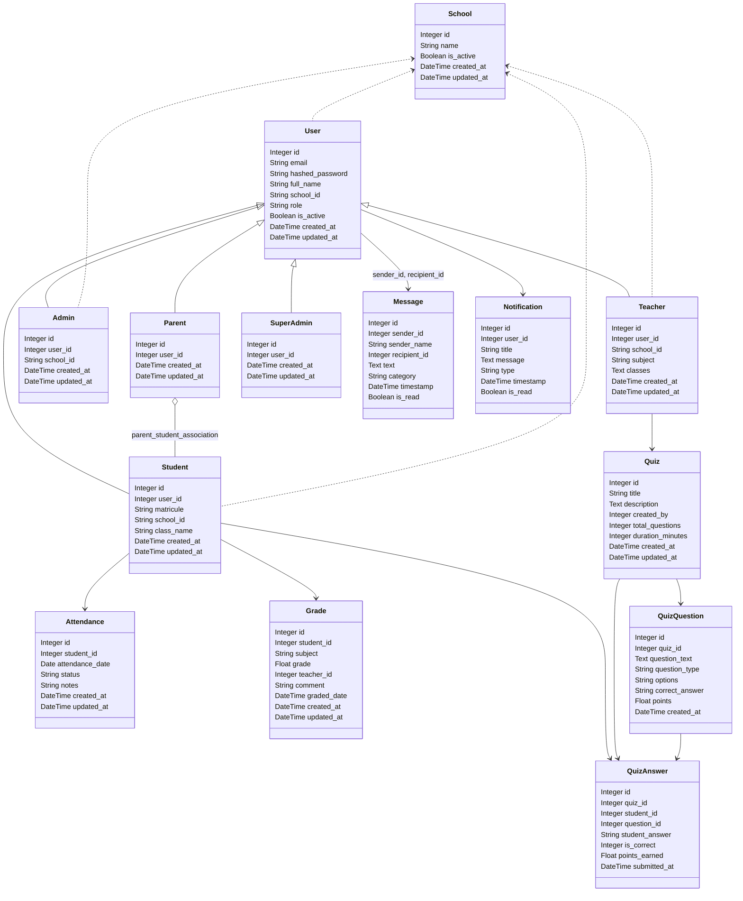
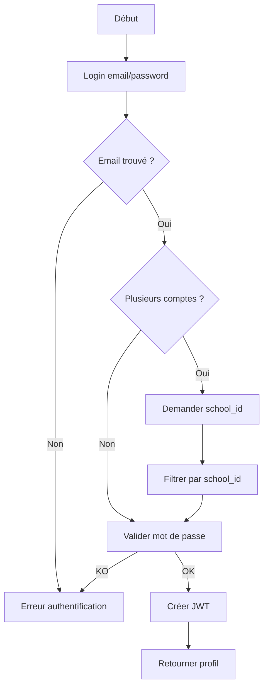
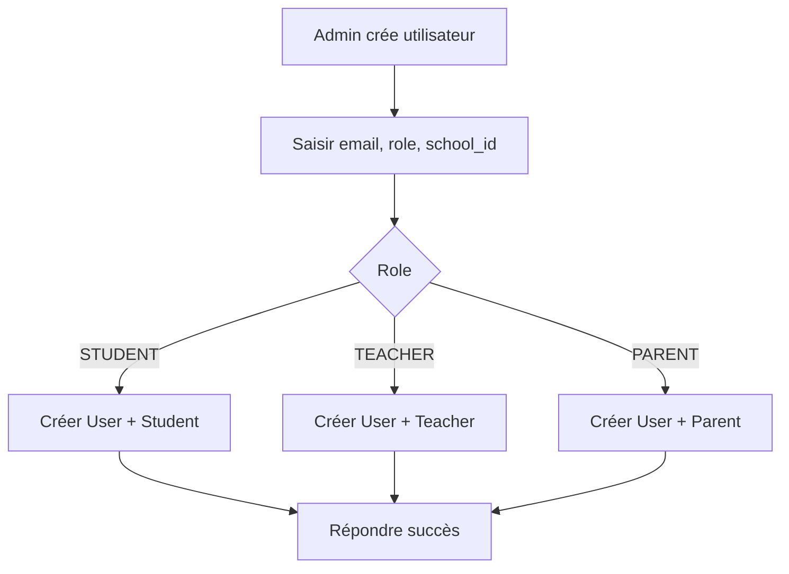
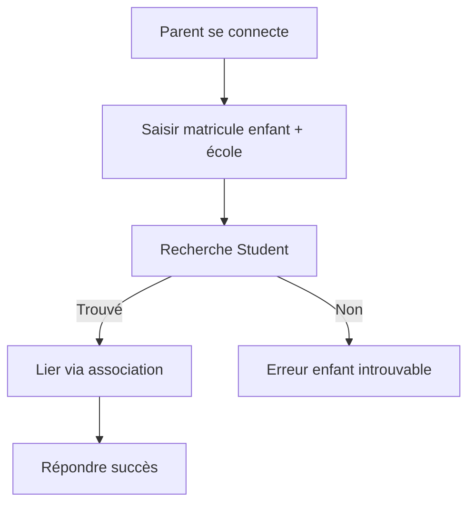
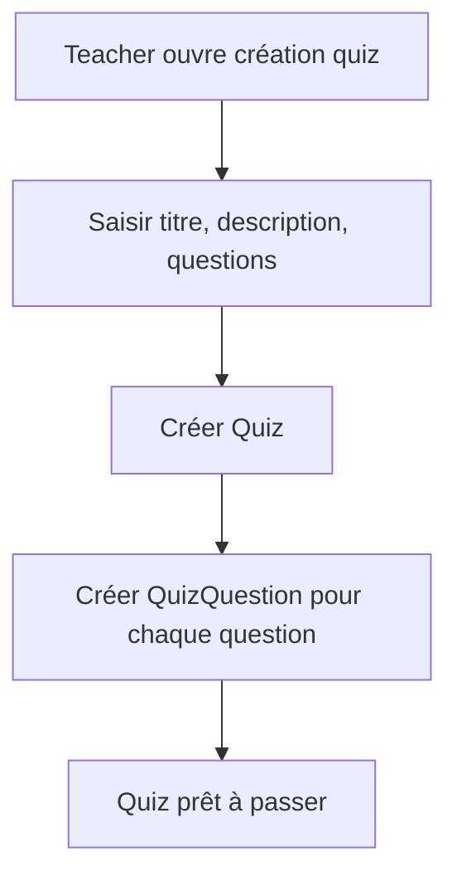
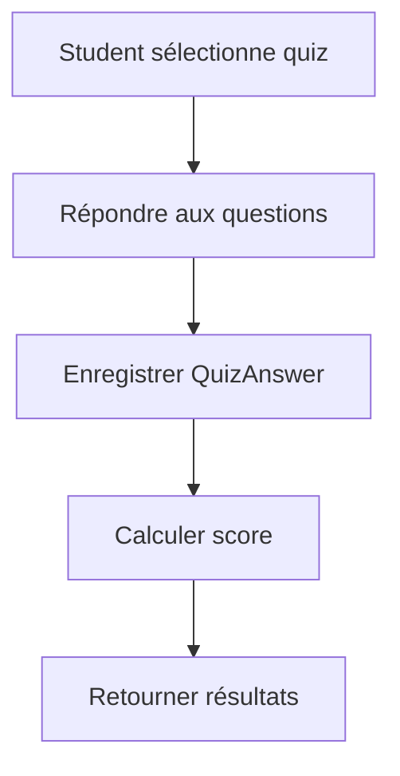

# Diagrammes système pour EduTrack

Ce document rassemble les informations nécessaires pour réaliser :
- le diagramme de classes
- le diagramme de cas d'utilisation
- les diagrammes d'activités

## 1. Modèles de données

### User
- id: Integer, PK
- email: String
- hashed_password: String
- full_name: String
- school_id: String
- role: String (`student`, `teacher`, `admin`, `parent`, `superadmin`)
- is_active: Boolean
- created_at: DateTime
- updated_at: DateTime

### Student
- id: Integer, PK
- user_id: Integer, FK -> users.id
- matricule: String, unique
- school_id: String
- class_name: String
- created_at: DateTime
- updated_at: DateTime

### Teacher
- id: Integer, PK
- user_id: Integer, FK -> users.id
- school_id: String
- subject: String
- classes: Text (JSON list)
- created_at: DateTime
- updated_at: DateTime

### Admin
- id: Integer, PK
- user_id: Integer, FK -> users.id
- school_id: String
- created_at: DateTime
- updated_at: DateTime

### Parent
- id: Integer, PK
- user_id: Integer, FK -> users.id
- created_at: DateTime
- updated_at: DateTime

### School
- id: Integer, PK
- name: String, unique
- is_active: Boolean
- created_at: DateTime
- updated_at: DateTime

### Attendance
- id: Integer, PK
- student_id: Integer, FK -> students.id
- attendance_date: Date
- status: String (`present`, `absent`, `late`, `justified`)
- notes: String?
- created_at: DateTime
- updated_at: DateTime

### Grade
- id: Integer, PK
- student_id: Integer, FK -> students.id
- subject: String
- grade: Float
- teacher_id: Integer, FK -> users.id
- comment: String?
- graded_date: DateTime
- created_at: DateTime
- updated_at: DateTime

### Quiz
- id: Integer, PK
- title: String
- description: Text
- created_by: Integer, FK -> users.id
- total_questions: Integer
- duration_minutes: Integer
- created_at: DateTime
- updated_at: DateTime

### QuizQuestion
- id: Integer, PK
- quiz_id: Integer, FK -> quizzes.id
- question_text: Text
- question_type: String (`multiple_choice`, `true_false`, `short_answer`)
- options: String (JSON list)
- correct_answer: String
- points: Float
- created_at: DateTime

### QuizAnswer
- id: Integer, PK
- quiz_id: Integer, FK -> quizzes.id
- student_id: Integer, FK -> students.id
- question_id: Integer, FK -> quiz_questions.id
- student_answer: String
- is_correct: Integer (`0`, `1`, ou null)
- points_earned: Float
- submitted_at: DateTime

### Message
- id: Integer, PK
- sender_id: Integer, FK -> users.id
- sender_name: String
- recipient_id: Integer, FK -> users.id
- text: Text
- category: String (`general`, `support`, `private`)
- timestamp: DateTime
- is_read: Boolean

### Notification
- id: Integer, PK
- user_id: Integer, FK -> users.id
- title: String
- message: Text
- type: String (`INFO`, `WARNING`, `ERROR`, `SUCCESS`)
- timestamp: DateTime
- is_read: Boolean

### SuperAdmin
- id: Integer, PK
- user_id: Integer, FK -> users.id
- created_at: DateTime
- updated_at: DateTime

### parent_student_association
- parent_id: Integer, FK -> parents.id
- student_id: Integer, FK -> students.id

## 2. Relations entre modèles

- `User` est la table principale d'authentification et d'identité.
- `Student`, `Teacher`, `Admin`, `Parent`, `SuperAdmin` sont des profils spécialisés liés à `User` via `user_id`.
- `School` représente un établissement. Chaque `User` et chaque profil lié a un `school_id`.
- `Student` a de nombreux `Attendance`, `Grade` et `QuizAnswer`.
- `Teacher` est lié à `User` et peut être auteur de `Quiz` (`created_by`).
- `Grade.teacher_id` référence `users.id` pour l'enseignant ayant noté l'élève.
- `Parent` et `Student` sont reliés via la table d'association `parent_student_association` (relation many-to-many).
- `Message` et `Notification` utilisent `User` comme expéditeur, destinataire ou propriétaire.
- `Quiz` contient des `QuizQuestion`.
- `QuizAnswer` relie un `Student` à un `QuizQuestion` et à un `Quiz`.

### Diagramme de classes Mermaid



## 3. Acteurs principaux

- `SuperAdmin`
- `Admin`
- `Teacher`
- `Student`
- `Parent`

### Capacités majoritaires

- `SuperAdmin` : gérer les écoles, créer des admins, consulter tous les utilisateurs.
- `Admin` : créer et gérer des `Student`, `Teacher`, `Parent` dans son établissement, consulter l'activité scolaire.
- `Teacher` : créer des quizzes, accéder aux notes, gérer l'assiduité des élèves.
- `Student` : se connecter, consulter ses notes, son assiduité, passer des quizzes.
- `Parent` : lier ses enfants, consulter le progrès et les notes de ses enfants.

## 4. Cas d'utilisation

### Cas d'utilisation principaux

1. Connexion / authentification
2. Inscription et création de comptes
3. Gestion des utilisateurs par l'administrateur
4. Gestion des élèves et profils
5. Gestion de l'assiduité
6. Gestion des notes
7. Création et passage de quiz
8. Lien parent-enfant
9. Lecture des notifications/messages
10. Consultation du progrès

### Diagramme de cas d'utilisation Mermaid

```mermaid
%%{init: {"theme": "base", "themeVariables": {"actorBorder": "#333", "actorBackground": "#f4f4f4", "primaryColor": "#2f6f9f"}}}%%
usecaseDiagram
    actor SuperAdmin
    actor Admin
    actor Teacher
    actor Student
    actor Parent

    SuperAdmin --> (Gérer les écoles)
    SuperAdmin --> (Créer des admins)
    SuperAdmin --> (Consulter tous les utilisateurs)

    Admin --> (Créer utilisateurs)
    Admin --> (Gérer élèves)
    Admin --> (Consulter rapports)

    Teacher --> (Créer quiz)
    Teacher --> (Gérer assiduité)
    Teacher --> (Noter un élève)
    Teacher --> (Voir résultats des quiz)

    Student --> (Passer un quiz)
    Student --> (Consulter notes)
    Student --> (Consulter assiduité)

    Parent --> (Lier enfant)
    Parent --> (Voir progrès de l'enfant)
    Parent --> (Voir enseignants de l'enfant)

    (Créer quiz) .> (Passer un quiz) : include
    (Passer un quiz) .> (Voir résultats des quiz) : include
    (Gérer élèves) .> (Consulter notes) : include
```

## 5. Activités clés

### 5.1 Flux : connexion et rôle

- L'utilisateur saisit email + mot de passe.
- Le système vérifie les credentials.
- Si plusieurs comptes avec le même email, il demande l'établissement (`school_id`).
- Le système crée un JWT et retourne le profil.



### 5.2 Flux : création d'un utilisateur par l'admin

- `Admin` ou `SuperAdmin` ouvre le formulaire de création.
- Il choisit `role` : `student`, `teacher`, `parent`.
- Il renseigne `school_id` et les attributs spécifiques.
- Le système crée un enregistrement `User` puis la fiche de profil correspondante.



### 5.3 Flux : un parent lie un enfant

- `Parent` se connecte.
- Il saisit `matricule` et `school_id` de l'enfant.
- Le système recherche le `Student`.
- Si l'enfant existe, il crée une entrée dans `parent_student_association`.
- Le parent peut ensuite consulter le progrès.



### 5.4 Flux : le professeur crée un quiz

- `Teacher` ouvre la page de création de quiz.
- Il saisit titre, description, durée et questions.
- Le système crée `Quiz` et ses `QuizQuestion`.
- Les élèves peuvent ensuite passer le quiz.



### 5.5 Flux : un étudiant passe un quiz

- `Student` sélectionne un quiz.
- Il répond aux questions.
- Le système enregistre chaque `QuizAnswer`.
- Il calcule le score à partir des réponses correctes.



## 6. Notes utiles pour réalisation

- Le profil `User` est central : toutes les identités et les rôles reposent dessus.
- Les rôles déterminent l'accès aux routes et aux entités.
- `parent_student_association` est la relation many-to-many entre `Parent` et `Student`.
- `QuizAnswer` est la table de calcul de résultats : elle relie `Student`, `Quiz` et `QuizQuestion`.
- Les activités doivent inclure les vérifications de rôle et la validation du `school_id`.

## 7. Endpoints les plus importants

- `POST /auth/login`
- `POST /auth/register`
- `GET /users/`, `POST /users/`, `POST /users/admin`
- `GET /students/`, `GET /students/{id}`, `GET /students/{id}/grades`, `GET /students/{id}/attendance`
- `POST /parents/link-child`, `GET /parents/my-children`, `GET /parents/children/{id}/progress`
- `GET /quizzes/`, `POST /quizzes/`, `GET /quizzes/{id}`, `POST /quizzes/{id}/submit`

---

Ce document fournit la base nécessaire pour générer les diagrammes UML et les cas d'utilisation métier du système EduTrack.
